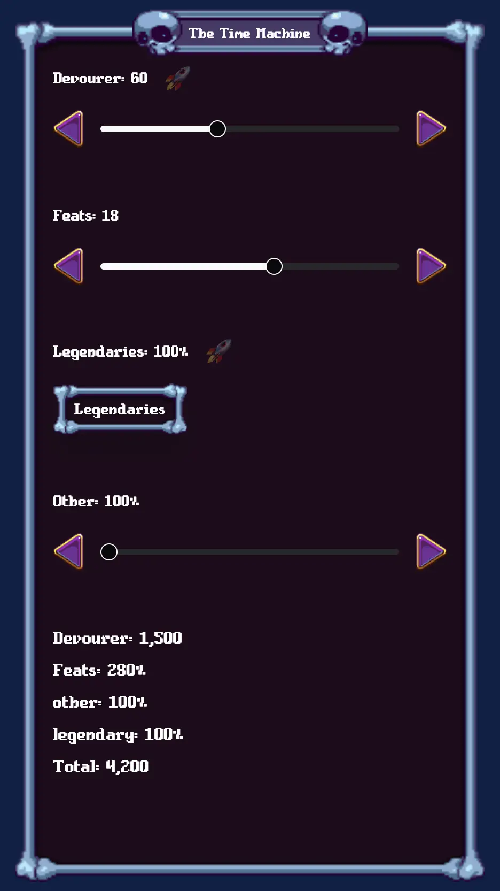

# Necromerger time shard calculator

This is a helper tool for the game Necromerger, built to simplify time shard and rune calculations.
It is designed to be mobile-friendly. All state is stored in the URL so setups can be easily shared.

It is best used alongside https://drallieiv.github.io/NecroMerger-Inventor/

# Features

1. Time shard calculator
2. Rune cost calculation (`desired legendary rune cost` - `owned legendary rune cost` = total)

## TODO's

- [ ] Merge `legendary-cost.svelte.ts` and `legendary-shards.svelte.ts`
- [ ] Move, refactor searchParams logic out of `layout.svelte`
- [ ] Tidy, refactor component dir
- [ ] Tidy import/exports `src/lib/index.ts`
- [ ] Remove dead code...
